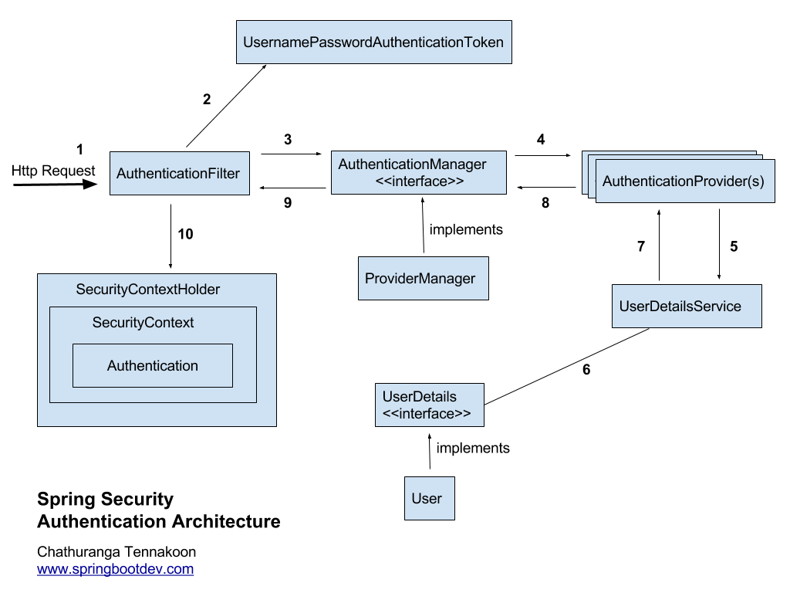

# 08장 스프링 시큐리티
## 8.1 인증과 인가
- 인증 authentication<br>
유저가 시스템에 접근 할 때 유저를 식별하는 프로세스이며, 인가 이전에 완료된다.
- 인가 authorization (또는 권한 부여)<br>
특정 리소스에 접근할 때 인증된 유저가 접근 권한을 가지고 있는 지 확인하는 프로세스<br><br>
❗ 권한 Authority 과 역할 Role의 차이<br>
권한과 역할의 차이는 접근 권한을 얼마나 쪼개는 가에 있다.<br>
접근 권한을 개별의 특정 행위로 규정할 때 Authority를 사용, 접근 권한을 특정 집단으로 규정할 때는 Role을 사용한다.
<br>예를 들어 쇼핑몰 구매 권한, 판매 권한, 좋아요 등은 권한. 관리자, 판매자, 구매자 등은 역할.
## 8.2 스프링 시큐리티
스프링 기반 애플리케이션의 보안을 담당하는 스프링 하위 프레임워크<br>
필터 기반으로 동작하며 각 필터에서 인증, 인가 등 관련 작업을 처리한다.

1. http Request 수신 - 클라이언트로부터 로그인 정보화 함께 인증 요청이 들어오면 AuthenticationFilter에서 인증 및 권한 부여의 목적으로 필터링<br>
만약 로그인이 이미 되어있다면 이미 Authentication 객체가 Http Session에 저장되어 있기 때문에 바로 SecurityContextHolder로 가서 Authenticatin 객체를 가져온다.
2. 필터링을 거쳐 추출한 유저 정보를 기반으로 인증 토큰(UsernamePasswordAuthenticationToken)을 생성한다.
3. 생성된 인증 토큰을 인증매니저(AuthenticationManger)로 보낸다. 인증 매니저가 가진 인증 메서드들이 호출된다.<br>
여기서 인증 매니저는 인터페이스이고 구현체인 ProviderManager이기 떄문에 해당 객체에 인증 토큰이 전달된다.
```
public class ProviderManager implements AuthenticationManager, MessageSourceAware, InitializingBean {
	// ...
	private List<AuthenticationProvider> providers = Collections.emptyList();
	// ...
	@Override
	public Authentication authenticate(Authentication authentication) throws AuthenticationException {
		Class<? extends Authentication> toTest = authentication.getClass();
		AuthenticationException lastException = null;
		AuthenticationException parentException = null;
		Authentication result = null;
		Authentication parentResult = null;
		int currentPosition = 0;
		int size = this.providers.size();
		for (AuthenticationProvider provider : getProviders()) {
			if (!provider.supports(toTest)) {
				continue;
			}
			if (logger.isTraceEnabled()) {
				logger.trace(LogMessage.format("Authenticating request with %s (%d/%d)",
						provider.getClass().getSimpleName(), ++currentPosition, size));
			}
			try {
				result = provider.authenticate(authentication);
				if (result != null) {
					copyDetails(authentication, result);
					break;
				}
			}
			catch (AccountStatusException | InternalAuthenticationServiceException ex) {
				prepareException(ex, authentication);
				throw ex;
			}
			catch (AuthenticationException ex) {
				lastException = ex;
			}
		}
		if (result == null && this.parent != null) {
			try {
				parentResult = this.parent.authenticate(authentication);
				result = parentResult;
			}
			catch (ProviderNotFoundException ex) {
			}
			catch (AuthenticationException ex) {
				parentException = ex;
				lastException = ex;
			}
		}

	}
}
```
AuthenticationProvider를 리스트로 관리하고 있고, authenticate()메서드에서 for문으로 리스트를 순환하며 provider 클래스의 supports() 메서드를 호출하며 인증 메커니즘을 수행한다.<br>
4. Authentication Provider(인증 제공자) 인터페이스는 유저가 입력한 정보롸 DB의 정보를 비교하는 일을 수행하고 아래와 같은 구현체들이 있다.
- DaoAuthenticationProvider : 유저 이름과 비밀번호를 사용한 인증 처리
- JwtAuthenticationProvider : JWT를 사용한 인증 처리
<br><br>이외에도 구현체들이 더 있지만 주로 언급되는 두 개만 적어두고 생략.
  AuthenticationProvider의 구현체는 특정 인증 메커니즘에 대한 인증을 수행하며, 사용자의 자격 증명을 확인하고, 사용자를 인증한다. 인증에 성공하면 인증된 Authentication 객체를 반환한다.
5. Authentication을 UserDetailsService에 넘기기<br>
UserDetailsService는 DB로부터 유저의 정보를 가져오는 인터페이스<br>
해당 인터페이스의 메서드로 유저 정보를 가져와서 AuthenticationProvider로 반환하면 그 곳에서 사용자가 입력한 정보와 DB에서 가져온 정보를 비교하는 작업을 수행한다.
6. UserDetailsService로부터 UserDetails 검색<br>
UserDetails 인터페이스는 사용자 정보를 캡슐화한것.<br>
Value Object (측정 값을 나타내는 객체)의 역할을 한다.<br><br>
구현 시 필수 오버라이드 메서드

| 메서드 | 반환타입 | 설명                      |
|---|---|---|
| getAuthorities() | Collections<? extends GrantedAuthority> | 사용자가 가지고 있는 권한 목록 반환    |
| getPassword() | String | 사용자를 식별할 수 있는 사용자 이름 반환 |
| getUsername() | String | 사용자의 비밀번호 반환            |
| isAccountNonExpired() | boolean | 계정 만료 여부 확인             |
| isAccountNonLocked() | boolean | 계정 잠금 여부 확인             |
| isCredentialNonExpired() | boolean | 비밀번호 만료 여부 확인           |
| isEnable() | boolean | 계정이 사용 가능한지 확인          |


7. AuthenticationProviders에게 UserDetails 객체 전달<br>
AuthenticationProviders는 UserDetails를 받아 유저 정보를 비교한다.
8. 성공 시 인증 객체 반환하고 실패 시 인증 예외 발생<br>
인증 완료된 Authentication 객체는 Principal(주체), Credentials(자격 증명), Authorities(권한), Authenticated(인증 여부)를 설정하여 반환한다.
- Principal(주체) : 사용자 아이디, User 객체
- Credentials(자격 증명) : 사용자 비밀번호
- Authorities(권한) : 인증된 사용자의 권한 목록
- Authenticated(인증여부)<br><br>
성공하면 AuthenticationSuccessHandler 실행, AuthenticationFailureHandler
9. 인증 완료 <br>
AuthenticationManager는 Authentication 객체를 관련 AuthenticationFilter로 반환한다.
10. SecurityContext에 Authentication 객체 저장<br>
- SecurityContext<br>
Authentication 객체가 저장되는 보관소
- SecurityContextHolder<br>
SecurityContext를 저장하는 객체
